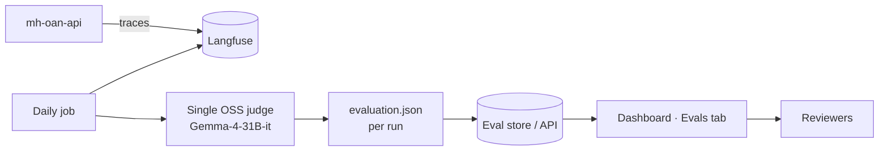

# Daily Production Evaluation — MH OAN API

**Version:** 8.0  
**Date:** 2026-07-08  
**Status:** Plan

---

## 1. Summary

Every **day**, a background job samples recent production conversations from **Langfuse**, runs them through **one LLM judge**, and writes results in the same shape as [oan-evaluation-ui](https://github.com/OpenAgriNet/oan-evaluation-ui). Reviewers open the **Evals** tab in the operations dashboard to see scores, trends, and flagged conversations — same UX as the OAN model evaluation dashboard (radar charts, category breakdown, per-conversation drill-down).

No automatic prompt or glossary changes. Humans triage from the UI.

---

## 2. Why

MahaVistaar must keep **Marathi language quality**, **tool/protocol compliance**, and **factual grounding** high at scale. Manual trace review does not scale. A daily judge pass surfaces:

- English leakage and wrong agri terminology in Marathi replies
- Skipped Agristack / `search_terms` workflow steps
- Weak or ungrounded answers

The department and engineering get a **stable daily view** instead of ad-hoc log diving.

---

## 3. Architecture



| Piece | Role |
|-------|------|
| **mh-oan-api** | Production chat; traces to Langfuse (full Q&A, langs, tools, `session_id`) |
| **Daily eval job** | Cron once per day; sample **K** traces from last **24 h**; call judge; emit JSON |
| **Judge** | One open-weight model on our infra (vLLM) |
| **Eval store** | Dated run folders, e.g. `production/2026-07-08/evaluation.json` |
| **Evals tab** | UI based on [oan-evaluation-ui](https://github.com/OpenAgriNet/oan-evaluation-ui) |

---

## 4. Daily job

| Setting | Default |
|---------|---------|
| Schedule | Once daily (e.g. 05:00 IST) |
| Window | Previous **24 hours** |
| Sample **K** | 50–200 (tune to volume and GPU time) |
| Stratify | By `target_lang`; always include errors and empty responses |

**Per trace**, the judge returns one `EvaluationItem` (see §6). The job appends all items for that day into a single `evaluation.json` for run id `production-{date}`.

---

## 5. Judge

**One model only** — no ensemble.

| | |
|--|--|
| **Model** | [Gemma-4-31B-it](https://huggingface.co/google/gemma-4-31B-it) |
| **Why** | Strong Indic/multilingual scores (IndicParam 46.48%); ~31B matches production scale; Apache 2.0 |
| **Infra** | vLLM on eval GPUs; offline batch — not on the farmer request path |
| **Config** | `temperature=0`; Gemma 4 thinking mode **off** for batch (`<|think|>` omitted) |

Fallback if VRAM is tight: [Gemma-4-26B-A4B-it](https://huggingface.co/google/gemma-4-26B-A4B-it) (MoE, 3.8B active).

---

## 6. Output format (oan-evaluation-ui compatible)

Match types in `oan-evaluation-ui/lib/evaluation-types.ts` so the **Evals** tab can reuse the same components without a parallel schema.

Each judged conversation becomes:

```json
{
  "question": "<user message>",
  "category": "<intent, e.g. Weather Forecast>",
  "agristack_required": "Yes | No",
  "farmer_id": "<masked or session_id>",
  "answer": "<full assistant response>",
  "trace_id": "<langfuse trace id>",
  "target_lang": "mr",
  "evaluated_at": "2026-07-08T05:12:00Z",
  "evaluation": {
    "dimensions": {
      "process_fidelity": { "scores": { "...": { "score": 4, "evidence": "..." } }, "average": 4.2 },
      "factual_grounding": { "scores": { "...": { "score": 5, "evidence": "..." } }, "average": 4.8 },
      "response_usefulness": { "scores": { "...": { "score": 4, "evidence": "..." } }, "average": 4.0 },
      "marathi_quality": { "scores": { "...": { "score": 3, "evidence": "..." } }, "average": 3.5 }
    },
    "summary": "One-line judge summary",
    "metrics": {
      "overall_average": 4.1,
      "critical_failures": ["marathi_quality.language_purity"],
      "critical_failure_count": 1,
      "overall_pass": true
    }
  }
}
```

**Sub-metrics** (18 total, 1–5 + evidence) — same as oan-evaluation-ui:

| Dimension | Metrics |
|-----------|---------|
| **Process fidelity** | Agristack workflow, term identification, tool sequencing, search quality, output hygiene |
| **Factual grounding** | Source alignment, no fabrication, citation accuracy, safety compliance |
| **Response usefulness** | Completeness, actionability, context fit, clarity, conversation closure |
| **Marathi quality** | Grammar, terminology, language purity, fluency |

For English-target sessions, score **Marathi quality** sub-metrics as `null` (UI already handles N/A).

---

## 7. Evals tab (dashboard)

Add a top-level **Evals** tab next to existing dashboard sections. Implementation follows [oan-evaluation-ui](https://github.com/OpenAgriNet/oan-evaluation-ui):

| UI section | Source component | What reviewers see |
|------------|------------------|-------------------|
| **Summary cards** | `summary-stats.tsx` | Daily pass rate, mean scores, critical failure count |
| **Overview** | `overview-radar-chart.tsx` | Radar over 18 metrics for the selected run |
| **By dimension** | `grouped-radar-charts.tsx` | Process / grounding / usefulness / Marathi |
| **Conversations** | `question-list-table.tsx` + `question-detail-view.tsx` | Paginated list; click row for scores, evidence, full Q&A |

**Filters** (reuse `filters-panel.tsx` patterns):

- **Run / date** — select daily `production-YYYY-MM-DD` (replaces multi-model picker for prod eval)
- **Category** — Weather, MahaDBT, Advisory, etc.
- **Agristack** — Yes / No / All
- **Critical failures only** — toggle

**Optional later:** compare last 7 daily runs as “models” in the same radar UI to spot regressions.

Data loading: point `MODEL_CONFIGS` (or equivalent) at daily run paths, e.g. `/api/evals/production-2026-07-08/evaluation.json`, or static hosting under `public/data/production-{date}/`.

---

## 8. Langfuse integration

**Minimum trace fields** (job fails if missing):

- `trace_id`, `session_id`
- `source_lang`, `target_lang`
- Full user query and assistant response
- Moderation outcome
- Tool / MCP calls and errors
- Timestamp

Judge may read trace metadata from Langfuse; **scores and issue notes** are written to the eval JSON and optionally back to Langfuse as scores/comments on the trace id.

---

## 9. Configuration

| Parameter | Example |
|-----------|---------|
| `EVAL_SCHEDULE` | `0 5 * * *` |
| `EVAL_WINDOW_HOURS` | `24` |
| `EVAL_K` | `100` |
| `JUDGE_MODEL` | `gemma-4-31b-it` |
| `EVAL_OUTPUT_DIR` | `/data/evals/production-{date}/` |
| `LANGFUSE_*` | Read traces |

---

## 10. Status

| Item | State |
|------|-------|
| Logfire on agents | In repo |
| Langfuse on chat path | Not wired — **blocker** |
| Daily eval job | Not built |
| Eval JSON writer | Not built |
| Dashboard **Evals** tab | Not built — use oan-evaluation-ui as reference |

**Order of work:** (1) Langfuse traces complete → (2) daily job + judge → (3) Evals tab consuming `evaluation.json`.

---

## 11. References

- [OpenAgriNet/oan-evaluation-ui](https://github.com/OpenAgriNet/oan-evaluation-ui) — dashboard UI, `evaluation-types.ts`, `evaluation.json` layout
- [Gemma 4 model card](https://ai.google.dev/gemma/docs/core/model_card_4)
- Langfuse — traces and optional score push-back

---

*Daily: Langfuse → sample K → Gemma-4-31B judge → `evaluation.json` → **Evals** tab.*