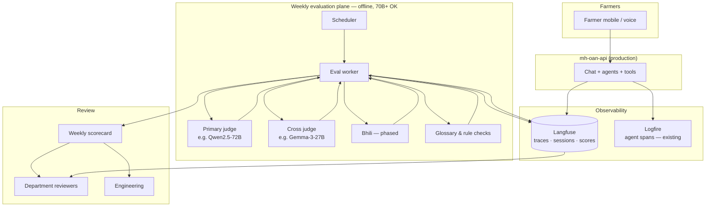
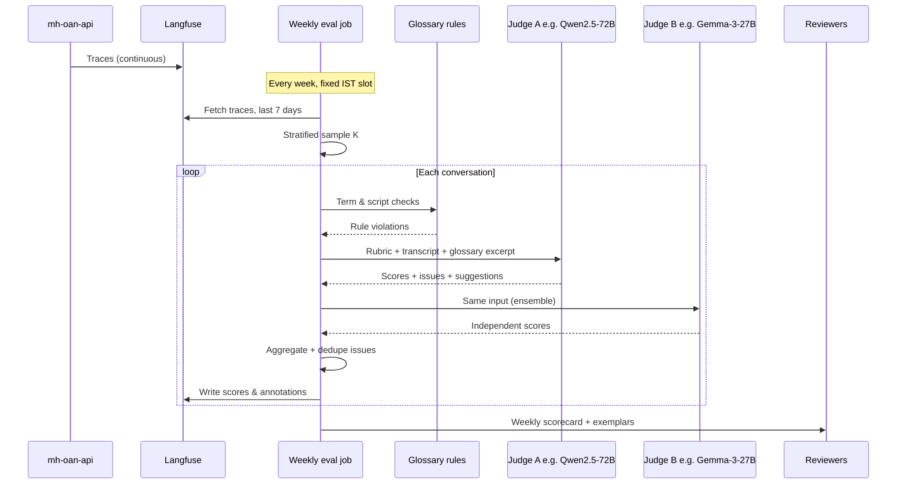
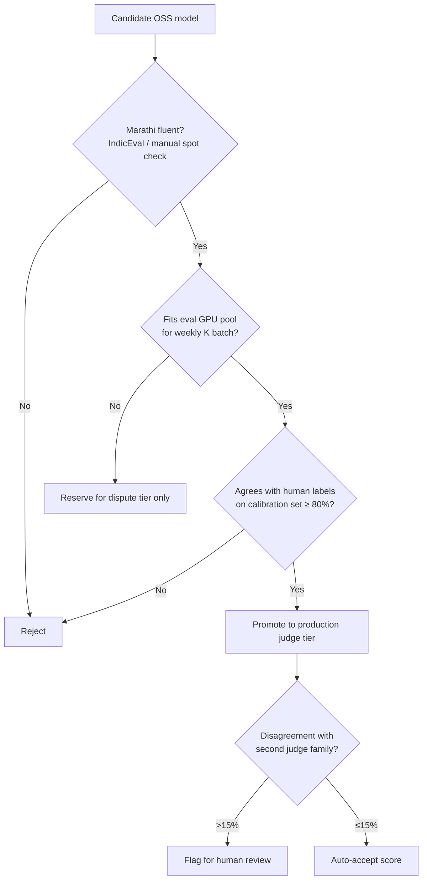
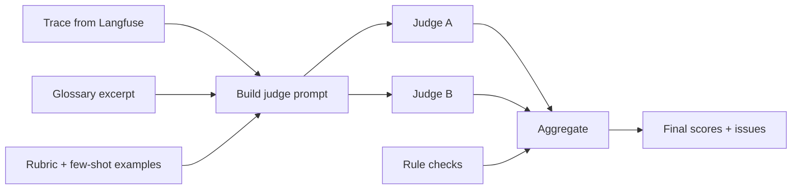
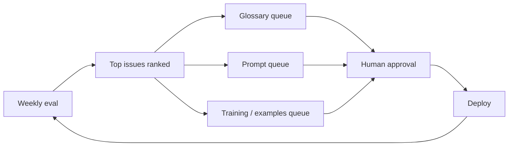

# Periodic Continuous Evaluation Plan — MH OAN API (MahaVistaar)

**Document version:** 7.1  
**Date:** 2026-07-08  
**Service:** `mh-oan-api` (Maharashtra Open Agri Network — Voice Assistant API)  
**Status:** Plan (pre-implementation)

---

## 1. What this is

A **weekly, automated quality review** of real farmer conversations.

Every week, a scheduled job pulls a sample of historic chat traces from **Langfuse** (primary telemetry store for this framework), sends each conversation to an **open-source LLM judge** running on **our infrastructure**, and produces:

- Dimension scores (language, accuracy, safety, tools, etc.)
- **Highlighted issues** — e.g. English words left in a Marathi reply, wrong crop name, overly formal tone
- **Suggested corrections** — proposed Marathi phrasing, glossary fixes, prompt gaps (for human review only; nothing auto-deployed)

Results are written back to Langfuse and rolled into a **weekly quality scorecard** for the department and engineering.

This is not ad-hoc log reading. It is a recurring audit loop that turns production traffic into actionable language and quality improvements.

---

## 2. Why we are doing this

### 2.1 The problem

MahaVistaar serves **rural Maharashtra farmers** who depend on clear advice in **Marathi** (and, on the roadmap, **Bhili**). The assistant must use correct agricultural terminology, a conversational tone, and the farmer's selected language — every time.

In practice, language quality issues show up in production even when the underlying agricultural information is correct:

| Issue class | What goes wrong | Farmer impact |
|-------------|-----------------|---------------|
| **Language mixing** | English crop/scheme/technical terms left in Marathi replies (e.g. "Potassium", "scheme status") | Reduces trust; farmers with low literacy cannot parse the answer |
| **Glossary drift** | Terms not taken from the authoritative Marathi glossary; inconsistent translations across sessions | Same concept named differently; confusion across follow-up questions |
| **Register mismatch** | Bureaucratic or textbook Marathi instead of farmer-friendly conversational style | Answers feel like government circulars, not a helpful neighbour |
| **Script handling** | Roman-script Marathi queries (`gahu`, `kanda`) mapped to wrong Devanagari terms | Wrong crop or input identified; downstream tool searches fail |
| **Language adherence** | Response in English when Marathi was selected (or vice versa) | Violates platform policy; breaks voice/TTS pipeline expectations |
| **Transliteration inconsistency** | Same English term transliterated differently across replies | Looks unprofessional; erodes confidence in advisories |
| **Bhili gap** | Marathi-first responses served to Bhili-speaking tribal farmers without dialect-aware phrasing | Exclusion of tribal communities the state is explicitly targeting |

These issues are **hard to catch manually** at scale. The service handles thousands of sessions; reviewers cannot read every trace. Spot checks miss regressions. Prompt or glossary changes can fix one failure mode and introduce another.

### 2.2 Why periodic LLM review

A **weekly batch LLM judge** over historic traces gives us:

1. **Coverage** — systematic review of K conversations per week, stratified by language and failure signals
2. **Consistency** — same rubric applied every week, comparable scores week-over-week
3. **Discovery** — surfaces patterns humans miss (e.g. "उर्वरक" replaced by English in 12% of fertilizer queries)
4. **Low risk** — suggestions go to humans; no automatic prompt or live-response changes

Research on LLM-as-a-Judge in multilingual and low-resource settings (Doğruöz et al., 2026; arXiv:2607.02235) warns that single judges over-trust their own judgments, especially outside English. This plan addresses that with **multi-judge ensembles**, **target-language rubrics**, and a **monthly human calibration subset**.

---

## 3. How this impacts us

### 3.1 Department (PoCRA / Agriculture)

- **Visibility** — weekly scorecard with mean language scores, issue counts, and exemplar trace IDs
- **Accountability** — evidence that advisories meet language policy before field outreach or scheme campaigns
- **Prioritisation** — "top 10 language issues this week" drives content and glossary review meetings
- **Bhili readiness** — early signal on translation quality as Bhili support rolls out

### 3.2 Engineering

- **Regression detection** — prompt deploy correlates with drop in `language_quality` score
- **Glossary maintenance** — judge flags terms missing from `glossary_terms.json`; batch updates
- **Trace completeness** — eval job fails loudly if Langfuse traces lack full Q&A or language metadata
- **Tooling feedback** — flags when `search_terms` / `search_documents` chains produce terminology mismatches

### 3.3 Farmers (indirect)

- Better Marathi over time: correct terms, consistent tone, fewer English leaks
- Faster fixes to systematic errors (e.g. wrong transliteration of scheme names)
- Path to **Bhili-native** advisories validated before wide tribal rollout

### 3.4 What we explicitly do *not* do

- No automatic prompt edits, glossary commits, or live response rewriting
- No farmer PII in judge prompts (Agristack fields remain masked as in production)
- No replacement of human field review for Bhili — LLM judge is a triage layer, not a native-speaker substitute

---

## 4. System architecture

### 4.1 Context diagram



**Today:** Logfire instruments Pydantic AI agents (`instrument=True`). Langfuse export on the chat path is **not yet wired** — first implementation milestone.

### 4.2 Weekly job sequence



### 4.3 Component responsibilities

| Component | Role |
|-----------|------|
| **mh-oan-api** | Serve farmers; emit complete chat traces |
| **Langfuse** | Store historic conversations; receive judge scores and issue notes |
| **Eval worker** | Sample, orchestrate judges, aggregate, publish scorecard |
| **OSS judge inference** | vLLM on dedicated eval GPUs — models **larger than the 30B production agent** are acceptable because judging is a weekly offline batch, not real-time inference |
| **Glossary rule layer** | Deterministic checks against authoritative term list (English leakage, known term mismatches) |
| **Scorecard** | Human-readable weekly summary for triage meetings |

---

## 5. Weekly process

### 5.1 Schedule

| Parameter | Default |
|-----------|---------|
| Cadence | Once per week |
| Window | Previous 7 days of production traffic |
| Time | Fixed weekday, IST (e.g. Monday 06:00) |
| Batch size **K** | 100–2000 (set from weekly volume and eval GPU capacity) |
| Judge stack | **Qwen2.5-72B** primary + **Gemma-3-27B** cross-judge (see §7); models **larger than the 30B production agent** are intentional |

### 5.2 Sampling strategy

1. **Stratify** by `target_lang` (Marathi, English; Bhili when live) and top intent categories
2. **Oversample** traces with: errors, empty responses, tool/MCP failures, moderation edge cases
3. **Always include** all safety-flagged or empty-response traces (may exceed K — cap with alert)
4. **Reserve 5%** of K each month for human-labeled calibration (same traces judged by field reviewers)

### 5.3 Per-conversation judge output

```json
{
  "trace_id": "...",
  "scores": {
    "language_quality": 4,
    "terminology": 3,
    "farmer_friendliness": 5,
    "agricultural_accuracy": 4,
    "language_adherence": 5,
    "tool_use": 4,
    "safety": 5
  },
  "issues": [
    {
      "type": "english_leakage",
      "severity": "medium",
      "evidence": "उत्तरात 'Potassium' इंग्रजीत आहे",
      "suggestion": "ग्लॉसरीनुसार 'पोटॅशियम' वापरा"
    }
  ],
  "suggested_marathi_rewrite": "...",
  "glossary_additions": ["..."],
  "prompt_gap_note": "..."
}
```

### 5.4 Push-back surfaces

| Destination | Content |
|-------------|---------|
| Langfuse | Per-trace scores, issue tags, reviewer notes |
| Weekly scorecard | Aggregates, trends, top issue types, exemplar IDs |
| Department dashboard | Optional roll-up via existing Vistaar telemetry if required |

---

## 6. Language quality — what we judge

Language quality is the **primary focus** of this framework. Other dimensions (tools, safety, accuracy) support triage but language is the main weekly report section.

### 6.1 Marathi rubric dimensions

| Dimension | Judge question | Failure examples |
|-----------|----------------|------------------|
| **Language adherence** | Is the full response in the selected language? | English paragraph in a Marathi-selected session |
| **Terminology** | Are crop, pest, scheme, and input names from standard Marathi agri vocabulary? | "cotton" instead of "कापूस"; wrong pest name |
| **No English leakage** | Are technical terms either Marathi or agreed transliteration? | "Fertilizer", "scheme", "warehouse" left in Latin script |
| **Glossary compliance** | Do flagged terms match the authoritative glossary? | Glossary says "कीटकनाशक", response says "pesticide" |
| **Register** | Is the tone simple, conversational, farmer-friendly? | Formal शासकीय prose for a weather question |
| **Script consistency** | Devanagari throughout (except proper nouns per policy)? | Mixed Roman and Devanagari in one reply |
| **Transliteration quality** | Are borrowed terms transliterated consistently? | "पोटॅशियम" vs "पोटेशियम" across sessions |
| **Roman input handling** | Was Roman Marathi query interpreted correctly? | `gahu` → wrong crop term in response |

### 6.2 English rubric dimensions

| Dimension | Judge question |
|-----------|----------------|
| **Clarity** | Plain language understandable to farmers with basic English |
| **Terminology** | Correct agricultural terms; glossary-aligned where bilingual mapping exists |
| **No inappropriate mixing** | No unexplained Marathi fragments in English-selected sessions |

### 6.3 Bhili rubric dimensions (phased)

Bhili (Dehvali dialect, ISO `bhb`) is **extremely low-resource**. Judging strategy is phased:

| Phase | When | Approach |
|-------|------|----------|
| **P0** | Bhili not yet in production | Marathi judge only; monitor Marathi→Bhili translation pipeline separately |
| **P1** | Bhili pilot | Marathi judge + AI4Bharat glossary post-edit rules (`mar2bhb` term pairs) |
| **P2** | Bhili in production | Dedicated Bhili judge model (fine-tuned or tribal LLM) + monthly native-speaker calibration |
| **P3** | Steady state | Ensemble: Bhili judge + Marathi back-translation check |

---

## 7. Open-source models for evaluation

All judging runs on **our infrastructure** (self-hosted, no vendor API dependency).

**Sizing principle:** Production already runs a **~30B agent**. The weekly evaluator is an **offline batch job** (once per week, not on the farmer request path), so we can — and should — deploy **larger open-weight models (70B class and above)** for higher Marathi nuance and more reliable rubric scoring. Latency is irrelevant; quality and calibration against human labels are what matter.

Final model choice requires a **calibration sprint** against 50–100 human-labeled Marathi (and Bhili) conversations before the first department-facing scorecard.

### 7.1 Marathi — recommended judge stack

| Tier | Model | Params | License | Why it fits |
|------|-------|--------|---------|-------------|
| **Primary** | [Qwen2.5-72B-Instruct](https://huggingface.co/Qwen/Qwen2.5-72B-Instruct) | 72B | Apache 2.0 | Strong multilingual instruction-following and JSON output; well-suited as the main Marathi quality judge at a scale above the 30B production agent |
| **Primary (alt.)** | [Gemma-3-27B-it](https://huggingface.co/google/gemma-3-27b-it) | 27B | Gemma license | 140+ language support; **IndicGenBench 63.4** — highest among open models in Google's multilingual eval suite; independent architecture from Qwen for ensemble diversity |
| **Cross-judge** | [Meta-Llama-3.3-70B-Instruct](https://huggingface.co/meta-llama/Llama-3.3-70B-Instruct) | 70B | Llama license | Mature instruction-tuned model; different tokenizer and training distribution from Qwen/Gemma — strong disagreement signal when models diverge |
| **Cross-judge (alt.)** | [Qwen3-32B](https://huggingface.co/Qwen/Qwen3-32B) | 32B | Apache 2.0 | Newer Qwen generation with improved reasoning; good if 72B VRAM is constrained |
| **Rubric specialist (optional)** | [prometheus-2-8x7b-v2.0](https://huggingface.co/prometheus-eval/prometheus-2-8x7b-v2.0) | 8×7B MoE | Apache 2.0 | Purpose-built LLM-as-judge (fine-grained rubric scoring); use as a third opinion on dimension scores, not sole Marathi judge |
| **Roman Marathi auxiliary** | [RomanSetu SFT native](https://huggingface.co/ai4bharat/romansetu-base-sft-native) | 7B | Apache 2.0 | AI4Bharat models for Roman-script Indic input; run **only** on the `roman_input_handling` dimension when query is Roman Marathi — not the primary judge |
| **Dispute / deep review** | [Qwen3-235B-A22B](https://huggingface.co/Qwen/Qwen3-235B-A22B) | 235B MoE (22B active) | Apache 2.0 | Tie-breaker when primary and cross-judge disagree by ≥2 points; also used for monthly 100% re-review of top exemplars |

**Recommended default ensemble (given 30B production baseline):**

```
Primary:   Qwen2.5-72B-Instruct
Cross:     Gemma-3-27B-it  OR  Llama-3.3-70B-Instruct
Dispute:   Qwen3-235B-A22B (≤10% of K)
Auxiliary: RomanSetu-7B (Roman-script queries only)
```

**Not recommended as sole Marathi judge:** English-only judge models (e.g. Prometheus 7B alone), or any single model without ensemble — research (Doğruöz et al., 2026) shows over-trust and inconsistency in multilingual settings.

**Benchmarking (model selection, not production):** [IndicEval](https://github.com/adithya-s-k/indic_eval) and [IndicGenBench](https://arxiv.org/abs/2404.16816) — run on candidate models before locking the production stack.

### 7.2 Infrastructure note — weekly batch at 70B scale

| Concern | Guidance |
|---------|----------|
| **VRAM** | 72B at BF16 ≈ 144 GB; use tensor parallelism across 2–4 GPUs (same cluster class as production, separate eval job queue) |
| **Throughput** | K=500 × ~3 judges ≈ 1,500 inferences/week — hours, not days; acceptable for Monday-morning scorecard |
| **Isolation** | Eval GPUs separate from production serving so weekly batch does not affect farmer latency |
| **Quantisation** | AWQ/GPTQ 4-bit acceptable for cross-judge if VRAM tight; **keep primary judge at BF16** for calibration stability |

### 7.3 Bhili — recommended judge stack

There is **no mature open-source Bhili LLM-as-judge** today. Do **not** rely on small MT adapters as judges.

| Asset | Source | Role in evaluation |
|-------|--------|-------------------|
| Bhili glossary (`mar2bhb` term pairs) | AI4Bharat / field team | **Deterministic** crop/scheme name validation — primary Bhili check in P1 |
| [AdiVaani parallel corpus](https://huggingface.co/datasets/adivaanihf/adivaani-tribal-parallel-corpus) | IIIT-H / community | Fine-tuning data for a Bhili judge LoRA on **Gemma-3 or Qwen base** |
| [Bhili ASR/TTS collection](https://huggingface.co/collections/ai4bharat/bhili-on-mahavistaar) | AI4Bharat | Future voice-loop evaluation |
| Maharashtra Bhili Tribal LLM | State initiative (AI4Agri2026) | Target production + judge model when weights are on-prem |
| **Large Marathi judge (§7.1)** | Qwen2.5-72B / Gemma-3-27B | Semantic review of Bhili responses via back-translation or side-by-side Marathi reference |

**Interim Bhili judge recipe (until tribal LLM is available):**

1. **Rule layer** — `mar2bhb` glossary: flag Marathi agricultural terms left untranslated in Bhili output
2. **Large-model semantic check** — Qwen2.5-72B compares Bhili response against the Marathi source advisory (meaning preservation, register, glossary compliance)
3. **Human review** — 100% of Bhili pilot traces weekly; LLM judge is assistive only
4. **Future** — fine-tune a Bhili judge adapter on Gemma-3-27B or Qwen2.5-72B using AdiVaani + agri parallel data; validate against native speakers before reducing human review rate

### 7.4 Model selection decision matrix



---

## 8. How LLM-as-judge works (detailed)

### 8.1 Pipeline per conversation



**Prompt contents (Marathi sessions):**

1. System: role as Marathi agricultural advisory quality reviewer
2. Rubric: dimension definitions with 1–5 scale anchors **written in Marathi**
3. Context: user query, assistant response, `source_lang`, `target_lang`, moderation outcome
4. Glossary excerpt: relevant term pairs from authoritative glossary (retrieved by keyword match on query)
5. Policy excerpts: language adherence rules (no English in Marathi replies, farmer-friendly register)
6. Output schema: JSON with scores, typed issues, evidence quotes, suggestions

**Critical design choices (from multilingual LLM-judge research):**

| Practice | Rationale |
|----------|-----------|
| Rubric in **target language** | Reduces English-centric bias in Marathi scoring |
| **Two judge families** (e.g. Qwen-72B + Gemma-27B) | Cuts single-model blind spots; disagreement → human queue |
| **Different model than production agent** | Avoids self-enhancement bias |
| **Structured JSON output** | Parseable; feeds Langfuse scores API |
| **Evidence quotes** | Reviewers verify without re-reading full trace |
| **Temperature 0** | Reproducible weekly scores |
| **Chain-of-thought internal, not stored** | Reasoning helps quality; don't persist farmer PII reasoning |

### 8.2 Rule layer (non-LLM)

Run **before** LLM judges — fast, deterministic:

- Regex / dictionary scan for Latin-script words in Marathi-target responses (allowlist: units, numbers, scheme codes)
- Match agricultural terms in response against glossary entries for the query's domain
- Detect selected-language mismatch (script heuristics)
- For Bhili: apply `mar2bhb` glossary substitution audit

Rule violations are **merged** with LLM issues; rules win on factual glossary conflicts.

### 8.3 Ensemble aggregation

| Signal | Weight |
|--------|--------|
| Judge A score | 40% |
| Judge B score | 40% |
| Rule layer pass/fail | 20% (binary penalty on affected dimensions) |

If `|score_A - score_B| ≥ 2` on any dimension → trace goes to **human review queue** regardless of average.

### 8.4 Human calibration (monthly)

- 5% of weekly K (same traces each month for trend stability)
- Rated by Marathi-speaking agri extension reviewers (+ Bhili native speakers for tribal traces)
- Compute Pearson correlation and Cohen's κ between human and ensemble
- **Gate:** if language_quality κ < 0.6, pause scorecard publication and recalibrate rubric

---

## 9. Strategy to improve language quality

Evaluation is only useful if it drives fixes. Weekly output feeds a **language quality improvement loop**:



### 9.1 Issue → action mapping

| Issue type | Typical action | Owner |
|------------|----------------|-------|
| `english_leakage` | Add/fix glossary entry; add negative example to system prompt | Eng + dept terminology |
| `glossary_mismatch` | Correct glossary term; audit `search_terms` matches | Eng |
| `register_too_formal` | Add farmer-friendly exemplar to prompt | Eng |
| `wrong_term_from_roman_input` | Improve Roman transliteration handling in `search_terms` examples | Eng |
| `language_adherence_failure` | Strengthen language adherence section; check `target_lang` injection | Eng |
| `bhili_marathi_residual` | Extend Bhili glossary; tune MT post-edit | Eng + tribal language team |
| `systematic_tool_terminology` | Fix upstream document/search content or term mapping | Eng + content |

### 9.2 Suggestion types the judge produces

1. **Inline language correction** — "Replace X with Y" for a specific trace (human applies to prompt/glossary, not auto-rewrite history)
2. **Glossary addition** — new `en → mr` (or `mr → bhb`) pair proposal with context
3. **Prompt gap** — "No guidance for scheme-status phrasing in Marathi" → ticket for `agrinet_system.md`
4. **Positive exemplar** — high-scoring traces recommended as few-shot examples (monthly curation)

### 9.3 Prioritisation

Rank issues by: `frequency × severity × farmer-facing impact`. Weekly scorecard leads with **top 5** by weighted count. Department meeting agenda item: approve glossary/prompt changes for top 3.

### 9.4 Bhili-specific improvement path

1. **Pilot phase** — 100% human review; LLM+glossary assist
2. **Collect failures** — Marathi terms leaking into Bhili, dialect preference violations
3. **Fine-tune** — LoRA judge adapter on Gemma-3-27B or Qwen2.5-72B using AdiVaani + agri parallel sentences
4. **Integrate tribal LLM** — when Maharashtra Bhili Tribal LLM is available on infra, swap into judge tier with continued human calibration

---

## 10. Judge dimensions (full scorecard)

| Area | Weight | Notes |
|------|--------|-------|
| **Language quality** | High | Primary focus — see §6 |
| **Agricultural relevance** | High | Addresses the farmer's actual question |
| **Terminology & glossary** | High | Tied to language quality |
| **Safety & moderation** | Medium | Consistent with moderation outcome |
| **Tool / MCP use** | Medium | Sensible calls; failures annotated |
| **Reliability** | Medium | Non-empty response; errors in trace |
| **Latency** | Low | Informational; not a language issue |

---

## 11. Weekly quality scorecard

| Section | Contents |
|---------|----------|
| Header | Week ID, date range, K reviewed, environments |
| Language summary | Mean `language_quality` by `target_lang`; WoW delta |
| Top issues | Counts by `issue.type`; top 5 with exemplar trace IDs |
| Glossary queue | New term proposals from judge |
| Prompt queue | `prompt_gap_note` items |
| Disputed traces | Judge disagreement or human-queue backlog |
| Reliability | Error rate, empty responses, tool failures |
| Trend | 4-week sparkline for language and safety |
| Actions taken | Changes deployed since last week (manual log) |

---

## 12. Configuration

| Parameter | Purpose | Example |
|-----------|---------|---------|
| `EVAL_K` | Conversations per weekly batch | `500` |
| `EVAL_WINDOW_DAYS` | Lookback window | `7` |
| `EVAL_SCHEDULE` | Cron expression | `0 6 * * 1` (Mon 06:00 IST) |
| `EVAL_ENV` | Trace filter | `production` |
| `JUDGE_MODEL_PRIMARY` | Main Marathi judge (≥30B) | `qwen2.5-72b-instruct` |
| `JUDGE_MODEL_CROSS` | Second judge family for ensemble | `gemma-3-27b-it` |
| `JUDGE_MODEL_DISPUTE` | Tie-breaker for judge disagreement | `qwen3-235b-a22b` |
| `JUDGE_MODEL_ROMAN` | Roman-script query auxiliary | `romansetu-base-sft-native` |
| `JUDGE_BHILI_ENABLED` | Phase gate | `false` until Bhili live |
| `LANGFUSE_*` | Read traces, write scores | — |
| `GLOSSARY_PATH` | Authoritative term file | bundled glossary JSON |
| `HUMAN_CALIBRATION_RATE` | Fraction for monthly calibration | `0.05` |

---

## 13. Implementation status

| Item | Status |
|------|--------|
| Logfire / Pydantic AI `instrument=True` | In production repo |
| Langfuse export on chat path | **Not implemented** — blocking milestone |
| Weekly eval worker | **Not implemented** |
| OSS judge deployment | **Not implemented** |
| Glossary rule layer | **Not implemented** |
| Vistaar `OE_*` telemetry | Partial; separate from this framework |

**First milestone:** Langfuse receives complete chat traces (user message, full assistant response, languages, moderation, tools, `session_id`) for every production conversation.

**Second milestone:** Weekly job runs on staging with K=50; human calibration before department-facing scorecard.

---

## 14. Minimum trace fields

Without these, the weekly judge cannot run:

- `session_id`
- `source_lang`, `target_lang`
- Full user query text
- Complete assistant response text (not truncated)
- Moderation classification and outcome
- Tool / MCP invocations with names, inputs, errors
- Timestamp, environment, trace ID

---

## 15. Risks and mitigations

| Risk | Mitigation |
|------|------------|
| LLM judge wrong on Marathi nuance | Dual-judge ensemble + monthly human κ gate |
| Bhili judging unreliable | Phase human-first; glossary rules; no auto-actions |
| Eval GPU cost at 70B+ scale | Weekly batch only (not real-time); eval GPUs isolated from production; dispute tier capped at ≤10% of K |
| PII in traces | Mask before judge prompt; same policy as production Agristack handling |
| Scorecard fatigue | Top-5 issues only; actionable queues; WoW trend not raw dumps |
| Prompt injection via farmer query | Judge sees moderation outcome; sandboxed JSON parsing |

---

## 16. Open questions

1. Confirm Langfuse project and retention policy for 7-day (or longer) lookback
2. GPU allocation for Qwen2.5-72B + Gemma-3-27B weekly batch at target K (separate from 30B production serving)
3. Department reviewer roster for monthly Marathi calibration
4. Bhili tribal language team availability for pilot human review
5. Whether Maharashtra Bhili Tribal LLM weights will be available for on-prem judge tier
6. Integration of scorecard into existing Vistaar department dashboard vs Langfuse-only

---

## 17. References

- Doğruöz et al. (2026). *Challenges and Recommendations for LLMs-as-a-Judge in Multilingual Settings and Low-Resource Languages.* arXiv:2607.02235
- AI4Bharat. *Bhili on MahaVISTAAR* collection; *RomanSetu* for Roman-script Indic
- Qwen Team. *Qwen2.5* technical report — arXiv:2407.10671
- Google DeepMind. *Gemma 3* — IndicGenBench multilingual evaluation
- Kim et al. (2024). *Prometheus 2* — open-source rubric-specialised judge. arXiv:2405.01535
- IndicEval — Indic LLM evaluation suite (model selection benchmarking)
- Langfuse docs — traces, sessions, scores API for evaluation push-back

---

*Weekly loop: sample K conversations from Langfuse → OSS LLM judges on our infra → language-focused scores and correction suggestions → Langfuse + scorecard → human-approved glossary and prompt improvements.*